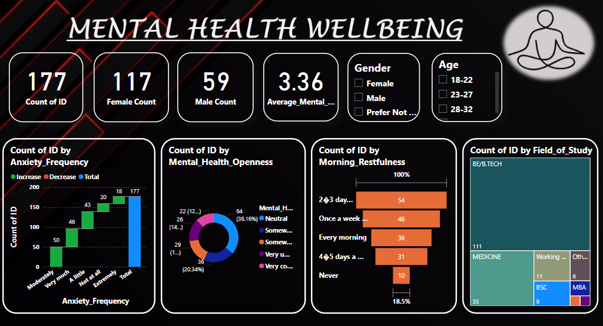

# mental-health-dashboard
A Power BI dashboard analyzing mental health trends and well-being among students.
# Mental Health Dashboard

## Project Overview
This project analyzes mental health trends and well-being among students using data collected through a survey. The dashboard visualizes insights such as stress levels, mood patterns, and emotional well-being to support data-driven decisions on mental health interventions.

## Features
- Interactive Power BI visualizations for data exploration.
- Dataset includes survey responses from 177 students.
- Built using Power BI and BigQuery
- Star schema for data warehousing and SQL queries for data processing.

## Tools & Technologies
- **Data Visualization**: Power BI
- **Data Storage**: Google BigQuery

## Dataset
- Contains responses from students about their mental health status and general feelings.
- Includes categorical and numerical data for analysis.

## Key Insights
- Identified trends in stress and emotional well-being.
- Highlighted factors influencing mental health patterns.
- Provided actionable recommendations for improving mental health support.

## How to Use
1. Download the `.pbix` file from this repository.
2. Open it using Power BI Desktop.
3. Explore the visualizations and insights.

## Project Screenshots

